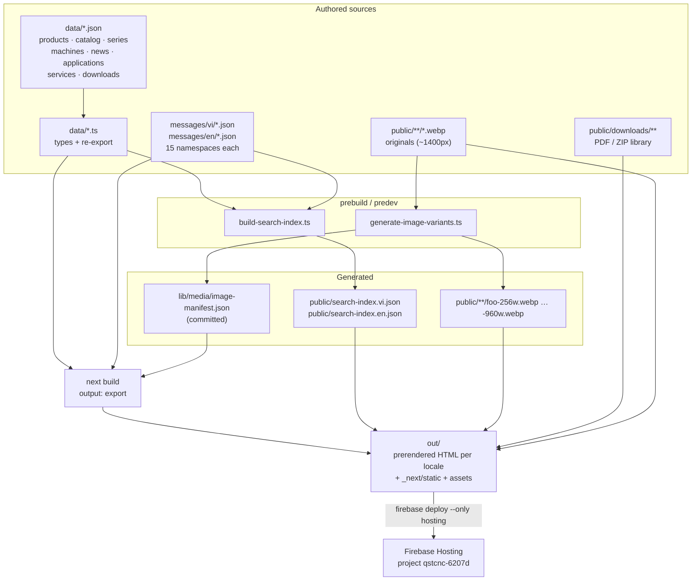
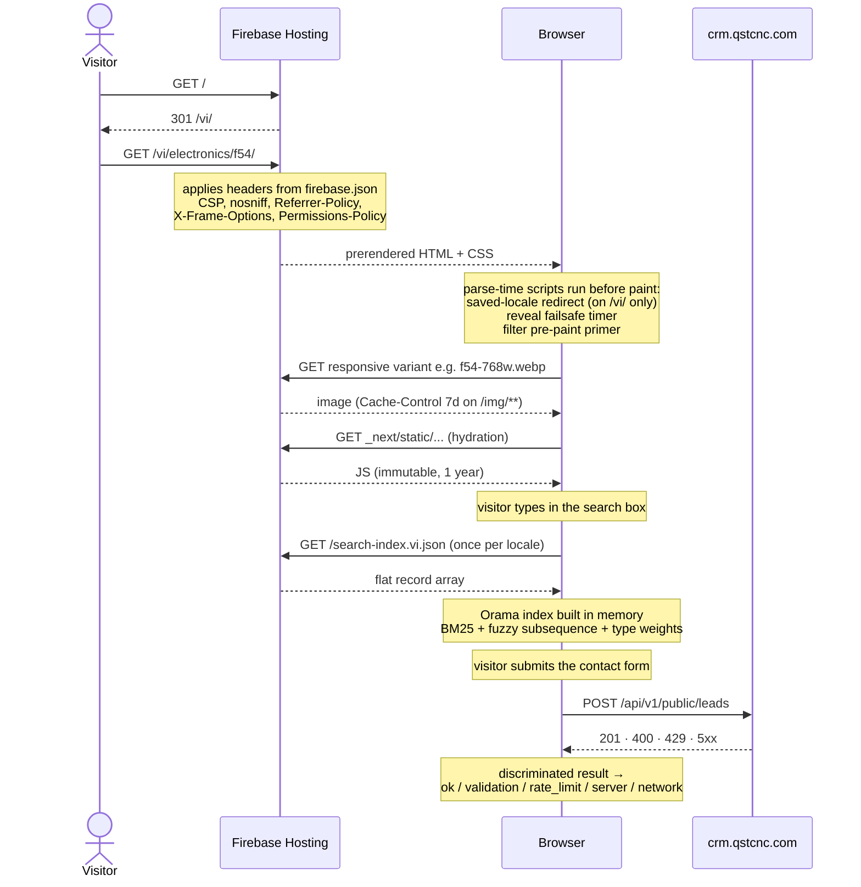
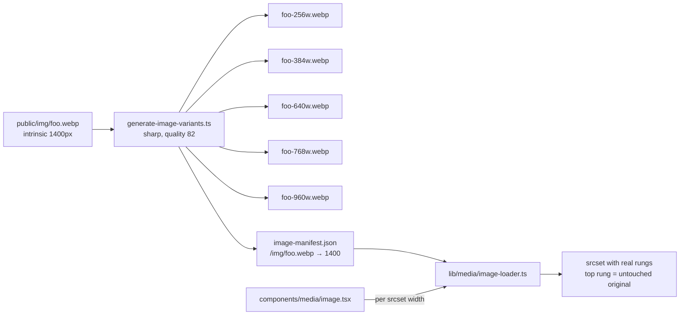
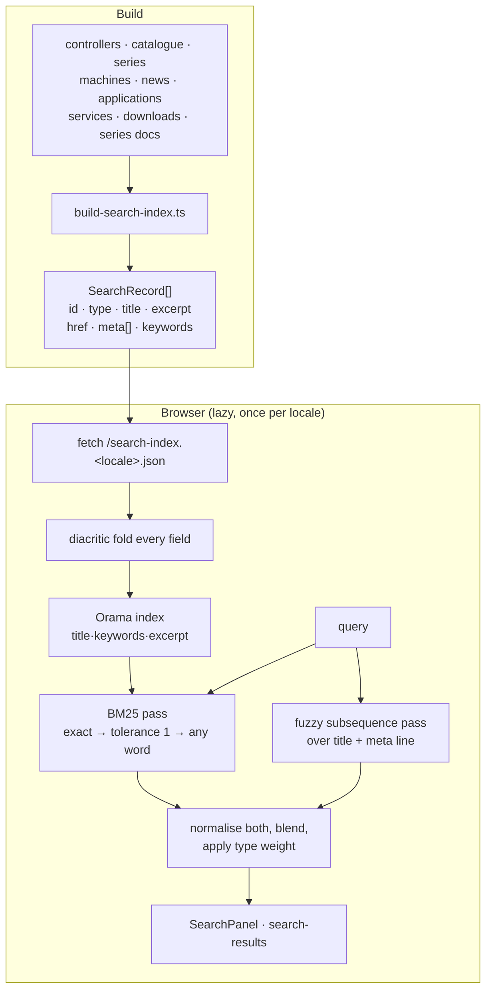

# System architecture

How `qs-shop` is put together: what happens at build time, what happens in the
visitor's browser, and why the boundaries fall where they do.

## The one decision everything follows from

The site is a **static export** (`output: "export"` in `next.config.mjs`). The
build produces a directory of HTML, CSS, JS and assets in `out/`, which Firebase
Hosting serves as files. There is no Node process in production, no database, no
API route, no middleware.

Four consequences shape the rest of this document:

| Because there is no server… | …the work moves to |
|---|---|
| `next/image` cannot resize on request | a build-time variant generator + a custom loader |
| a search backend cannot rank queries | a prebuilt JSON index + Orama in the browser |
| Next's `headers()` and `redirects()` never run | `firebase.json` |
| filter/query state cannot be read during render | URL-mirrored client state + a pre-paint primer script |

---

## Build pipeline



### What each stage does

**`build-search-index.ts`** flattens every content type that has a page —
controllers, catalogue units, drive/inverter series, machines, downloads (both
the local library and each series' document list), news, applications, services —
into one flat record array per locale. It runs outside next-intl, so where a
label lives in the message catalogue rather than in the data (download doc types,
machine spec labels, service copy) it reads `messages/<locale>/*.json` from disk
directly. Only text a visitor can actually see on the destination page is
indexed, so a hit always leads somewhere the query is visible.

**`generate-image-variants.ts`** walks `public/`, and for each non-variant
`.webp` re-encodes every ladder width smaller than the original (quality 82,
bounded to 8 concurrent sharp jobs, skipping variants newer than their source).
It writes `lib/media/image-manifest.json` mapping each source path to its
intrinsic width. The manifest is the only generated artefact that is committed —
so a clean checkout typechecks — while the variants themselves are gitignored and
rebuilt.

**`next build`** prerenders every route for both locales. `generateStaticParams`
in the locale layout yields `vi` and `en`; each dynamic segment adds its slugs.
`app/sitemap.ts` and `app/robots.ts` are `dynamic = "force-static"`, so they
export as real files.

---

## Runtime path



`crm.qstcnc.com` is the only origin in the CSP `connect-src` besides `'self'`,
and `i.ytimg.com` the only remote image host — both exist for exactly one feature
each (the lead form and YouTube poster stills).

---

## Layer boundaries

```
data/*.json          raw rows, authored elsewhere
   ↓  data/*.ts      types + cast, no logic
   ↓  lib/data/*.ts  locale resolution, derivations, fallbacks  →  *View types
   ↓  app/**/page.tsx  + _components/    rendering only
```

Pages never import from `data/` directly for content; they call
`lib/data/<entity>` and receive a `…View` in which every localizable field is
already a single string for the active locale. This is what keeps the
Vietnamese-primary / English-sibling convention out of the JSX: `toView()`
resolves `descEn ?? desc` once, and the template just prints `desc`.

Derivations live in the same layer. `lib/data/machine-datasheet.ts` computes the
CNC datasheet's spec groups, performance strip, working-space readout and
envelope wireframe from the machine's own `specs` array rather than storing them
as separate content — and returns `null` for rows a machine does not publish, so
the view can draw an "updating" placeholder and every machine page keeps the same
shape regardless of how complete its datasheet is.

---

## Internationalisation

| Concern | Where | Mechanism |
|---|---|---|
| Locale set | `lib/i18n/config.ts` | `["vi","en"]`, default `vi` |
| URL policy | `lib/i18n/routing.ts` | `localePrefix: "always"` — both locales carry a prefix |
| Message loading | `lib/i18n/request.ts` | reads every `messages/<locale>/*.json`, one namespace per file |
| Navigation | `lib/i18n/navigation.ts` | locale-aware `Link`, `usePathname`, `useRouter` |
| Client payload | `lib/i18n/client-messages.ts` | explicit allow-list of message paths |
| Per-row content | `data/*` + `lib/data/*` | Vietnamese primary field, English sibling field |

**Why the client-message allow-list exists.** `NextIntlClientProvider`
serialises whatever it is given into every page's flight payload. Handed the
whole catalogue it inlines roughly 78 KB of JSON into each document, most of it
for namespaces only ever read on the server (`application.detailPage` alone is
30 KB and no client component can reach it). `CLIENT_MESSAGE_PATHS` lists the
nine paths a `"use client"` component actually reads, cutting about 60% of that.
A listed path that resolves to nothing throws during prerender, so a stale entry
fails the build rather than shipping a page whose client components render raw
key paths.

**Why the `/vi/` → `/en/` script exists.** The `/` → `/vi/` redirect is decided
by the host and cannot know anything about the visitor, so someone who previously
chose English still lands on Vietnamese. The inline script recovers that one
behaviour, narrowly: only at the locale root (a shared `/vi/electronics/…` link
is an explicit destination and must not be bounced), and only from an explicitly
stored choice — never `navigator.language`, because sniffing would bounce every
first-time English visitor, and Googlebot executes JS, so a crawl of `/vi/` that
redirected itself away would undermine the page being indexed. An empty
`localStorage` is exactly the crawler's state, so it stays put.

---

## Media pipeline



The ladder is `VARIANT_WIDTHS = [256, 384, 640, 768, 960]`. `next.config.mjs`
mirrors it as `imageSizes [256, 384]` and `deviceSizes [640, 768, 960, 1400]` so
every width the browser can pick has a file behind it — a width with no file
resolves to the next rung up and would otherwise print the same variant twice as
two candidates. The small rungs matter more than they look: product shots are
tall (some 1400×2734), so even a 640px copy is far heavier than a 64px thumbnail
needs.

The loader returns the original — tagged `?w=<intrinsic>` — when no variant sits
between the requested width and the source. The tag exists because `next/image`
probes the loader once and warns that it "does not implement width" if the URL
comes back byte-identical to `src`; a static host ignores the query, and the tag
is constant per image so the top srcset rungs still share one fetch.

`components/media/image.tsx` is the wrapper every component imports instead of
`next/image`. It marks an image `unoptimized` when the ladder cannot produce more
than one distinct URL for it (logos, swatches, PNGs, remote posters), so those
render as a plain `` rather than a srcset whose entries all point at the
same file. It also gives `priority` images `fetchPriority="high"`, because
`priority` alone only emits the preload link and leaves the tag itself queued
behind the rest of the document.

---

## Search



**Ranking, and why each part is there.**

- Field boosts `title 3 · keywords 2 · excerpt 1`.
- The BM25 pass is tried strictest-first: every word as typed, then with
  single-character typo tolerance, then any single word. Order matters because of
  Vietnamese — its words are one short syllable, so a one-character tolerance
  turns `tần` into `tăng`, `tân`, `tấn`, `tan`, matching a third of the index, and
  a union across words then ranks a document holding one loose syllable above the
  page holding the whole phrase.
- The fuzzy subsequence pass (VS Code / fzf style) runs regardless. It is what
  lets `as10` reach "Astro 10i": the characters appear in order in the title even
  though tokenisation never produces an `as10` token. It scores contiguous runs
  and word-boundary matches higher and rejects matches whose characters are
  spread more than 4× the query length apart.
- Both signals are normalised to `[0,1]` and blended with `FUZZY_WEIGHT = 1`, so
  a strong title match can stand in when BM25 finds nothing without drowning real
  content hits.
- A final per-type tilt: `product · machine · app · service = 1`, `news = 0.9`,
  `pdf = 0.6`. A model query like `sdv3` is a request for the product, not for
  its twelve manuals; without the tilt the per-series document library fills a
  results page on title matches alone and pushes the page the visitor asked for
  out of sight.
- Everything indexed and every query is diacritic-folded (NFD decompose, drop
  combining marks, map `đ`/`Đ` → `d`), so a Vietnamese query works with or
  without accents. Folded text is used only for matching; the original record is
  what the UI renders.

The header panel builds the engine lazily on the first keystroke; the results
page builds it on mount. Both key the built engine by the locale it was built
for, so a locale switch invalidates it by derivation rather than a reset.

---

## Filtering under static export

Catalogue, downloads and news list pages mirror their filter state in the URL
(`?g=<group>&t=<type>`, plus `&d=` on downloads). Two pieces make that work
without a server:

1. **`lib/use-filter-params.ts`** keeps the state in a module-level store read
   through `useSyncExternalStore`, deliberately not `useSearchParams`. Reading
   search params during render opts the whole client subtree out of static
   rendering, which would hand crawlers an empty shell where the product cards
   belong. Here the server snapshot is always empty, the prerendered HTML carries
   the full unfiltered catalogue, and the URL is applied once on hydration. The
   store also patches the History API, because the App Router performs
   client-side navigation by writing the URL directly and that fires no event.

2. **`lib/filter-prepaint.tsx`** emits a blocking parse-time script above the
   list. It reads the URL and injects a `<style>` hiding elements whose
   `data-f-<key>` attributes do not match, before the browser's first paint —
   otherwise a shared filter link visibly paints the unfiltered list and snaps
   after hydration. React never renders the `<script>` element itself (a script
   created during a client render is inert); it is handed over as the inner HTML
   of a hidden wrapper. `FilterPrePaintCleanup` removes the primer style on mount
   once React owns the DOM.

---

## SEO surface

| Emitted | By |
|---|---|
| `<title>` / description, per-route | each route's `generateMetadata` + `messages/*/seo.json` |
| canonical + hreflang (vi, en, x-default) | `lib/seo/alternates.ts` via `localeUrl()` |
| `sitemap.xml` | `app/sitemap.ts` — two entries per page, alternates on both |
| `robots.txt` | `app/robots.ts` |
| OG images | `app/opengraph-image.tsx` + per-slug routes under electronics, news, applications |
| JSON-LD | `lib/seo/jsonld.tsx` — Organization + WebSite in the layout, Product / Article / Service / BreadcrumbList per page |

Every absolute URL goes through `localeUrl(path, locale)`, which produces the
exact canonical shape — locale prefix plus trailing slash. A URL differing by a
missing prefix or slash reads to a crawler as a separate page and splits the
entity across two URLs.

Canonicals are self-referencing per locale (an English page canonicalises to its
own English URL, not the Vietnamese one) so both language versions get indexed
rather than English being treated as a duplicate. `x-default` points at
Vietnamese.

Error pages (`403`, both not-found routes) set `robots: { index: false, follow:
false }`. The static export serves the 404 document with a 200 status, so the
noindex tag is what a 404 status would otherwise have implied.

---

## Hosting layer

Because a static export ignores Next's `headers()` and `redirects()`, both live
in `firebase.json`:

- **Redirects (301):** legacy unprefixed paths → `/vi/…`; `/products` and
  `/products/*` → `/electronics/*` for both locales; `/cnc` and `/cnc/*` →
  `/machine-building/*` for both locales; `/vi|en/cnc/qsm-125` →
  `…/machine-building/qsm-215` listed before the `/cnc/*` splats so the renamed
  machine lands in one hop. `/downloads/*` has no splat rule on purpose — the
  PDFs live under `public/downloads/` and a splat would 301 them into a
  non-existent locale path.
- **Headers:** CSP (`default-src 'self'`; `img-src` adds blob/data and
  `i.ytimg.com`; `script-src`/`style-src` allow `'unsafe-inline'`; `connect-src`
  adds `https://crm.qstcnc.com`; `frame-src` youtube-nocookie;
  `frame-ancestors 'none'`), `X-Content-Type-Options: nosniff`,
  `Referrer-Policy: strict-origin-when-cross-origin`, `X-Frame-Options: DENY`,
  `Permissions-Policy` disabling camera/microphone/geolocation/payment.
- **Cache-Control:** `/_next/static/**` immutable 1 year, `/downloads/**` 1 day,
  `/img/**` 7 days.

`'unsafe-inline'` in `script-src` is required by the parse-time scripts described
above (saved-locale redirect, reveal failsafe, filter pre-paint primer) and by
Next's own inline bootstrap.

---

## Resilience details worth knowing

| Failure | Handling |
|---|---|
| Client JS never arrives (404'd chunk, throw before hydration) | a parse-time timer adds `.qs-reveal-failsafe` after 4 s, which un-hides all scroll-reveal content; `Reveal` marks the document hydrated first when it does mount |
| JS disabled entirely | a `<noscript>` style in the locale layout forces reveal content visible |
| Search index unavailable | both search surfaces catch the fetch and leave results empty rather than throwing |
| CRM unreachable | the lead client returns `{ ok: false, kind: "network" }` and the form shows a network message |
| Bot submitting the contact form | honeypot field; a filled honeypot resets the form and reports success without POSTing |
| Unmatched URL | Firebase serves `out/404.html`, which localises itself in-page |
